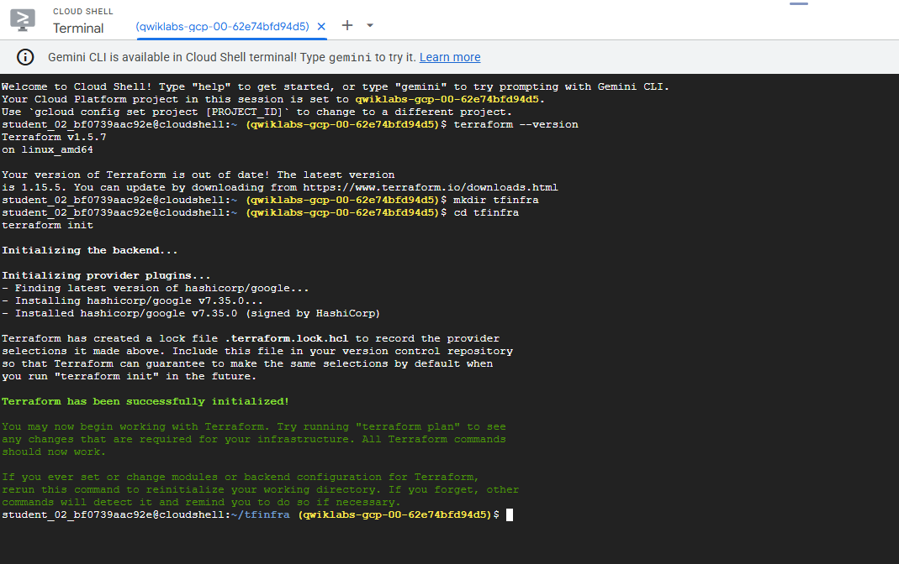
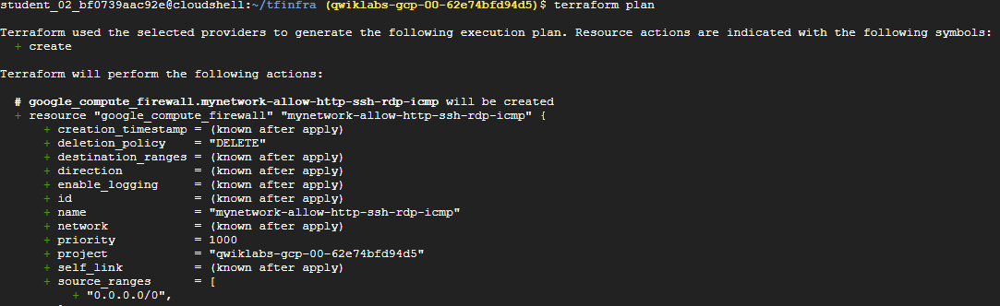
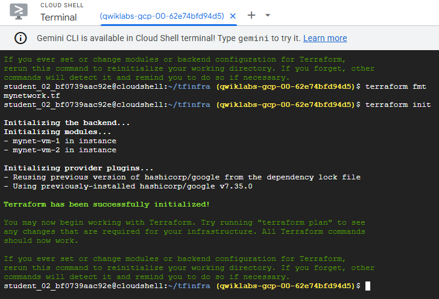

# Terraform — GCP Multi-Region Network Infrastructure

Provision a VPC network, firewall rules, and VM instances across multiple Google Cloud regions using Terraform modules. Deployed and validated via Google Cloud Shell.

---

## Architecture

```
GCP Project
└── VPC: mynetwork  (auto-create subnetworks)
    ├── Firewall: allow HTTP (80), SSH (22), RDP (3389), ICMP
    ├── VM: mynet-vm-1  →  asia-south1-c
    └── VM: mynet-vm-2  →  europe-west4-b
```

**Resources provisioned:**

| Resource | Type | Description |
|---|---|---|
| `mynetwork` | `google_compute_network` | Auto-subnet VPC |
| `mynetwork-allow-http-ssh-rdp-icmp` | `google_compute_firewall` | Inbound traffic rule |
| `mynet-vm-1` | `google_compute_instance` (module) | VM in asia-south1-c |
| `mynet-vm-2` | `google_compute_instance` (module) | VM in europe-west4-b |

---

## Project Structure

```
terraform-gcp-network/
├── provider.tf               # Google provider + Terraform version constraints
├── variables.tf              # Root input variables (project_id, region)
├── mynetwork.tf              # VPC, firewall, and module calls
├── terraform.tfvars.example  # Variable template (copy → terraform.tfvars)
├── modules/
│   └── instance/
│       ├── main.tf           # google_compute_instance resource
│       ├── variables.tf      # instance_name, zone, network, machine_type
│       └── outputs.tf        # name, zone, internal IP, external IP
└── screenshots/              # Deployment evidence
```

---

## Prerequisites

- [Terraform](https://developer.hashicorp.com/terraform/install) >= 1.0
- A GCP project with the **Compute Engine API** enabled
- Authentication: `gcloud auth application-default login` or a service account key

---

## Usage

```bash
# 1. Clone the repository
git clone https://github.com/<your-username>/terraform-gcp-network.git
cd terraform-gcp-network

# 2. Configure variables
cp terraform.tfvars.example terraform.tfvars
# Edit terraform.tfvars and set your project_id

# 3. Initialize Terraform (downloads Google provider)
terraform init

# 4. Preview the execution plan
terraform plan

# 5. Apply — creates 4 resources
terraform apply

# 6. Destroy when done
terraform destroy
```

---

## Deployment Walkthrough

### 1. Terraform init

Initializes the backend, downloads the `hashicorp/google` provider (v7.35), and resolves the `instance` module.



### 2. Terraform plan

Generates an execution plan showing the 4 resources to be created — the VPC, firewall rule, and two VM instances.



### 3. Terraform apply

Applies the configuration. All resources are created successfully.



---

## Key Concepts Demonstrated

- **Custom VPC with auto-subnets** — `auto_create_subnetworks = true` creates one subnet per region automatically.
- **Firewall rules via self_link** — the firewall references `google_compute_network.mynetwork.self_link` to stay loosely coupled from the network name.
- **Reusable modules** — the `instance` module is called twice with different zones, eliminating duplication and enforcing consistent VM configuration.
- **Input variable separation** — sensitive values (project ID) are kept out of tracked files via `terraform.tfvars` (gitignored).

---

## Technologies


---

## Author

**Gonzalo Correa Jimenez** — IAM Engineer & Cloud Security  
[LinkedIn](https://www.linkedin.com/in/) · [GitHub](https://github.com/)
